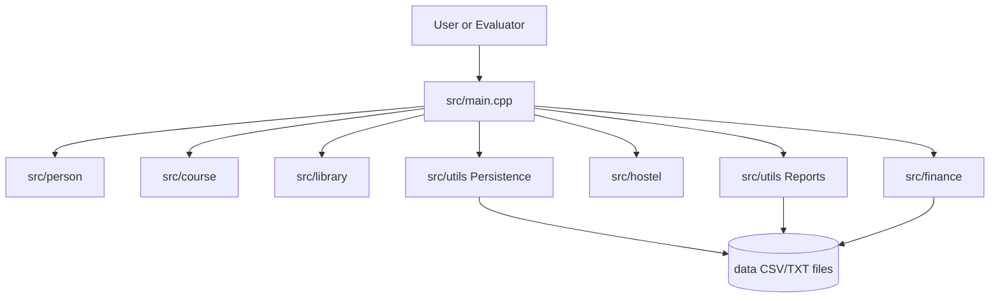
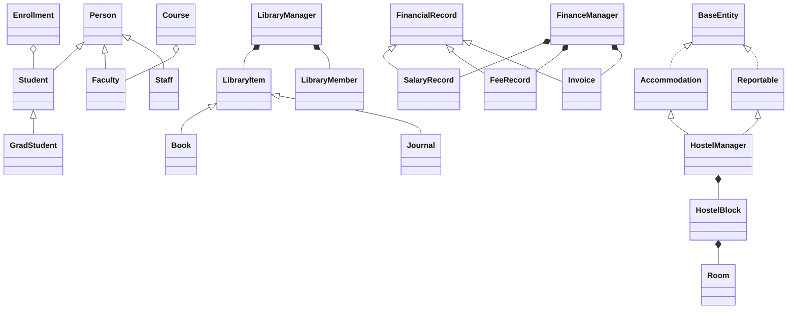
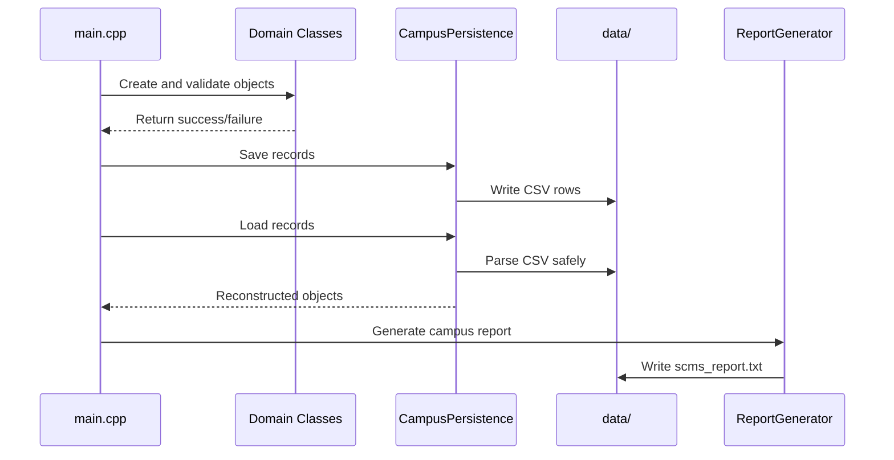

# System Architecture

## Overall Architecture

SCMS uses a modular console architecture. Domain modules live under `src/`, the main integration layer is `src/main.cpp`, and reusable reporting/persistence utilities live under `src/utils`. Each module owns its own classes and responsibilities, while `main.cpp` demonstrates how they work together.

The system uses a file-based persistence layer instead of a database. CSV and TXT files are stored in `data/`. The `CampusPersistence` service saves and reloads data across modules, while `FinanceManager` keeps its finance-specific CSV functions.

## High-Level Diagram



## Module Relationship Diagram



## Folder Structure

```text
src/
├── main.cpp
├── person/
├── course/
├── library/
├── finance/
├── hostel/
└── utils/

data/
└── CSV/TXT persistence files

docs/
├── PROJECT_OVERVIEW.md
├── SYSTEM_ARCHITECTURE.md
├── OOP_CONCEPTS.md
├── MODULE_DOCUMENTATION.md
├── UML_DOCUMENTATION.md
├── INSTALLATION_GUIDE.md
├── VIVA_PREPARATION.md
├── TESTING_REPORT.md
└── UML/
```

## Data Flow



## Runtime Modes

- `./scms.exe`: interactive menu.
- `./scms.exe --self-test`: complete module demonstration.
- `./scms.exe --persistence-seed`: writes canonical data.
- `./scms.exe --persistence-verify`: reloads saved data.
- `./scms.exe --persistence-append-test`: verifies append-mode persistence.

## Architecture Notes

Managers own objects through value containers or smart pointers. Aggregation is represented by non-owning pointers or IDs. This keeps ownership clear and makes OOP concepts visible in the code.
