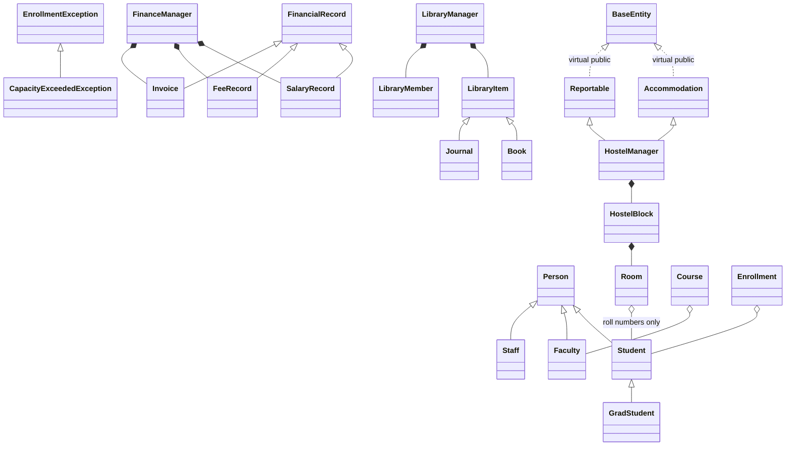
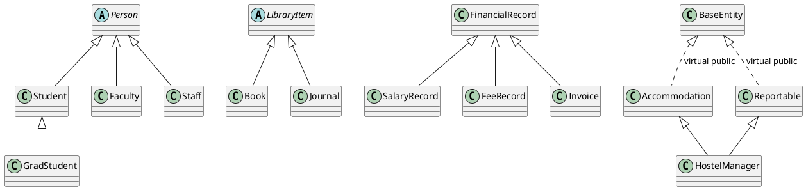

# UML Documentation

The full UML artifact set is located in `docs/UML/`.

Files:

- `class_diagram.mmd`: Mermaid class diagram source.
- `class_diagram.puml`: PlantUML class diagram source.
- `class_diagram.md`: UML explanation and fallback hierarchy.
- `class_diagram.png`: rendered UML image.

## Mermaid UML Overview



The full Mermaid source is available in `docs/UML/class_diagram.mmd`.

## PlantUML UML Overview



The full PlantUML source is available in `docs/UML/class_diagram.puml`.

## Inheritance Diagram

```text
Person
├── Student
│   └── GradStudent
├── Faculty
└── Staff

LibraryItem
├── Book
└── Journal

FinancialRecord
├── SalaryRecord
├── FeeRecord
└── Invoice
```

## Composition Diagram

```text
LibraryManager
├── vector<unique_ptr<LibraryItem>>
└── vector<LibraryMember>

FinanceManager
├── vector<SalaryRecord>
├── vector<FeeRecord>
└── vector<Invoice>

HostelManager
└── vector<HostelBlock>
    └── vector<Room>
```

## Aggregation Diagram

```text
Course ---- Faculty        non-owning pointer
Enrollment ---- Student    non-owning pointer
Room ---- Student          stores roll numbers only
LibraryMember ---- Item    stores item IDs only
```

## Multiple and Virtual Inheritance Diagram

```text
          BaseEntity
          /        \
 virtual /          \ virtual
        /            \
Accommodation    Reportable
        \            /
         \          /
        HostelManager
```

## Template Usage

`Library<T>` is a class template. `searchByTitle<T>()` is a function template that works with title-bearing objects.

## Friend Relationships

- `Course` declares `operator<<` as a friend.
- Finance records and manager use `generateFinanceSummary()` as a friend function.
- `Invoice` declares `FinanceManager` as a friend class for controlled invoice counter restoration.
