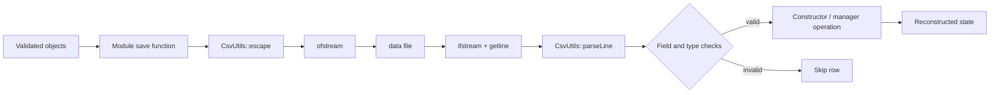

# Persistence Explained

## 1. Architecture

Persistence is divided into three responsibilities:

```text
Domain objects
    |
    v
CampusPersistence / FinanceManager / ReportGenerator
    |
    v
CsvUtils
    |
    v
data/*.csv and data/scms_report.txt
```

- `SCMS::Persistence::CsvUtils` handles directories, file opening, CSV
  escaping, row parsing, and safe numeric/Boolean conversion.
- `SCMS::Persistence::CampusPersistence` coordinates person, course, library,
  hostel, finance-summary, and generic `saveToFile/loadFromFile` operations.
- `FinanceManager` owns its detailed finance and invoice CSV logic.
- `SCMS::Reports::ReportGenerator` exports and reloads the text report.

All streams are automatic objects. Their destructors close file handles, which
is RAII.

## 2. Automatic File Creation

At program startup, `main()` calls:

```cpp
SCMS::Persistence::CampusPersistence::ensureDataFiles();
```

`ensureDataFiles()` uses `CsvUtils::ensureFile()` for every expected file.
`std::filesystem` creates the parent directory if necessary. New CSV files
receive one header row; the report file receives an initial message.

## 3. Actual Data Files and Schemas

| File | Header or format |
|---|---|
| `students.csv` | `Name,CNIC,Age,Contact,RollNo,Department,CGPA` |
| `faculty.csv` | `Name,CNIC,Age,Contact,EmployeeId,Designation,Salary` |
| `staff.csv` | `Name,CNIC,Age,Contact,EmployeeId,Role,Salary` |
| `undergrad_students.csv` | `Name,CNIC,Age,Contact,RollNo,Department,CGPA,ProjectTitle,AcademicAdvisor` |
| `courses.csv` | `CourseCode,CourseTitle,CreditHours,MaxCapacity,EnrolledStudents,FacultyEmployeeId` |
| `enrollments.csv` | `StudentRollNo,CourseCode,Semester,Grade` |
| `library_items.csv` | `Type,ItemId,Title,Available,Creator,IdentifierOrVolume,YearOrIssue` |
| `library_members.csv` | `MemberId,MemberName` |
| `library_borrowings.csv` | `MemberId,ItemId` |
| `hostel_blocks.csv` | `ManagerEntityId,BlockName` |
| `hostel_rooms.csv` | `BlockName,RoomNumber,RoomType,FloorNumber,MaxCapacity` |
| `hostel_allocations.csv` | `BlockName,RoomNumber,StudentRollNo` |
| `scms_finance_audit.csv` | salary/fee tagged union with nine columns |
| `invoices.csv` | invoice base fields, persisted counter, count, and variable line-item fields |
| `finance_summary.csv` | `Metric,Value` |
| `scms_report.txt` | formatted human-readable consolidated report |

## 4. Save Process

The common save flow is:

1. Validate the destination path.
2. Create its parent directory if needed.
3. Open an `std::ofstream` in truncation or append mode.
4. write a header when the file is new/empty or being replaced.
5. iterate over valid in-memory records.
6. escape every text field.
7. write one logical record per line.
8. return stream success.

### Overwrite Mode

When `append == false`, `CsvUtils::openOutput()` replaces the old file and
writes a fresh header.

### Append Mode

When `append == true`, it opens with `std::ios::app`. A header is written only
when the target is missing or empty. Existing rows remain intact.

## 5. CSV Escaping

CSV text can contain commas, quotes, or line-sensitive content. `CsvUtils`
escapes fields rather than concatenating raw strings. A quoted field doubles
embedded quote characters. The matching parser understands quoted commas.

Example:

```csv
CourseCode,CourseTitle
CS202,"Object-Oriented Programming, C++"
```

Without escaping, the comma inside the title would incorrectly create a third
column.

## 6. Load Process

The common load flow is:

1. Open an `std::ifstream`.
2. read one line at a time with `std::getline`.
3. ignore empty lines.
4. parse the line with `CsvUtils::parseLine`.
5. identify and skip the header.
6. verify the exact/minimum field count.
7. parse numbers and Booleans with checked helper functions.
8. reject duplicates where required.
9. construct domain objects inside `try/catch`.
10. skip invalid rows without terminating the whole load.
11. move successfully reconstructed collections into the target manager.

This is defensive parsing: one damaged record does not discard every valid
record.

## 7. Safe Numeric Parsing

`parseInt`, `parseFloat`, and `parseDouble` verify conversion and range rather
than calling an unchecked conversion and assuming success. The destination is
updated only when the full value is valid. `parseBool` accepts the project's
persisted Boolean representation.

Examples of rows that are skipped:

- text in an integer capacity field;
- a fractional or overflowing integer;
- an unknown item type;
- an incorrect number of columns;
- an invalid grade;
- a duplicate course code or invoice number;
- a record rejected by a class constructor.

## 8. Module Flows

### Person

`savePersons()` receives polymorphic `unique_ptr<Person>` objects. It uses
`dynamic_cast` to identify the concrete role and writes it to the correct CSV.
The `UndergradStudent` check occurs before `Student` because an undergraduate
is also a student.

`loadPersons()` reads four files and reconstructs concrete objects behind
`unique_ptr<Person>`.

### Course

Courses and enrollment rows are stored separately. The course file stores an
instructor employee ID, while enrollment rows store student roll number,
course code, semester, and grade. Loading validates duplicate course codes.

### Library

Library persistence uses three files:

- item definitions and availability;
- member definitions;
- member-to-item borrowing relationships.

Loading creates items and members first, then replays borrowing relationships.
This ordering ensures referenced objects exist before an issue operation.

### Finance

`FinanceManager::saveToCsv()` writes tagged `SALARY` and `FEE` rows.
`loadFromCsv()` checks the record tag and reconstructs the correct derived
record. Duplicate record IDs are rejected.

Invoice persistence stores:

- financial record fields;
- invoice number and payer;
- paid status;
- current static invoice counter;
- line-item count;
- escaped line-item values.

Loading checks IDs, invoice numbers, numeric values, and line-item count, then
restores the highest persisted counter so future invoice numbers remain safe.

### Hostel

Hostel state is normalized across:

- block rows;
- room rows linked by block name;
- allocation rows linked by block and room.

Loading creates the manager and blocks, then rooms, then allocations. This
dependency order prevents allocations from referencing absent rooms.

### Reports

`ReportGenerator::exportTextReport()` writes formatted text to
`data/scms_report.txt`. Append mode is supported. `loadTextReport()` reads the
complete file back into a string.

## 9. Actual File Flow



## 10. Persistence Verification Modes

The main program contains dedicated flows:

- seed/demo save operations create known records;
- `verifyPersistedData()` reloads records and searches for known IDs;
- `testAppendPersistence()` appends records and confirms they are recoverable;
- report save/load confirms text persistence.

These tests matter because saving and loading in one process alone is weaker
evidence than loading data created by a previous run.

## 11. Failure Handling

Write functions return `false` when a path is empty, a directory cannot be
prepared, a stream cannot open, or output enters a failed state. Load functions
return failure for unavailable mandatory files but skip individual malformed
records. Domain exceptions are caught at row boundaries.

## 12. Limitations and Production Upgrade

CSV has no transaction isolation, concurrent writer control, schema migration,
relational constraints, authentication, or efficient indexed queries. A
production multi-user SCMS would normally use a database and a repository/data
access layer. CSV remains suitable here because it is transparent, dependency
free, and directly demonstrates C++ file I/O.

## 13. Persistence Viva Questions

1. Why is the header not repeated in append mode?
2. Why must items and members load before borrowing relationships?
3. Why is the concrete person type identified before writing?
4. What happens when one CSV row is corrupted?
5. Why is invoice counter state persisted?
6. How does RAII protect stream handles?
7. Why is CSV escaping necessary?
8. What consistency problems could occur with two concurrent writers?
