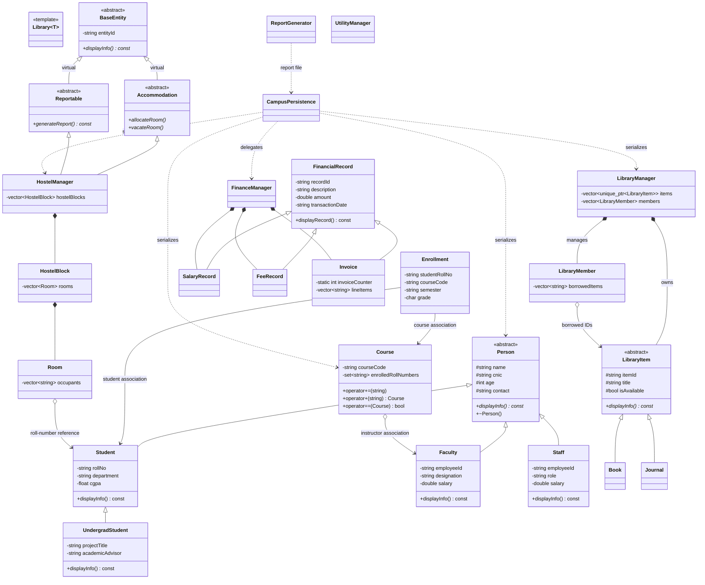
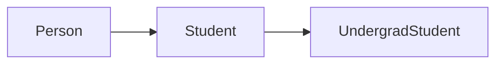
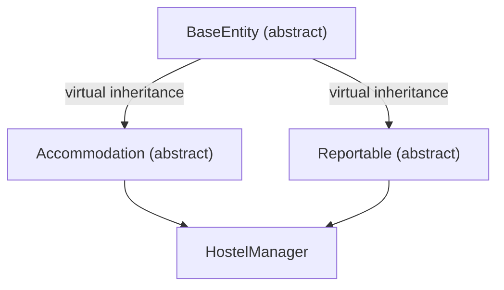
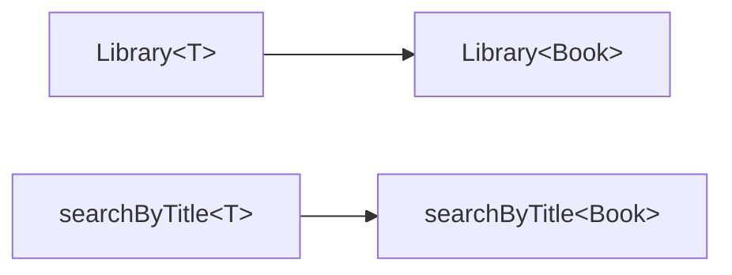
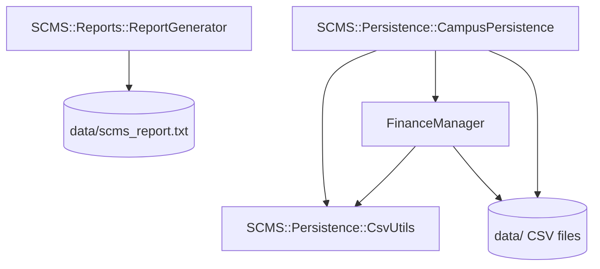

# UML and Relationships

## 1. Core Class Diagram



`*` after an operation indicates a pure virtual operation in this documentation.

## 2. Inheritance

Inheritance represents an “is-a” relationship.

- `Student`, `Faculty`, and `Staff` are persons.
- `UndergradStudent` is a student and therefore also a person.
- `Book` and `Journal` are library items.
- salary, fee, and invoice records are financial records.
- `HostelManager` is both an accommodation service and reportable entity.

Public inheritance allows the derived object to be substituted where the base
contract is expected.

## 3. Multilevel Inheritance



The undergraduate class receives common identity from `Person`, academic
identity from `Student`, and adds project/advisor data at the third level.
Constructor execution proceeds from `Person` to `Student` to
`UndergradStudent`; destruction runs in reverse.

## 4. Multiple and Virtual Inheritance



With ordinary inheritance, the two paths would produce two `BaseEntity`
subobjects. Virtual inheritance makes both paths share one. The most-derived
`HostelManager` constructor is responsible for initializing the virtual base.

## 5. Composition

UML composition uses a filled diamond. It means strong ownership.

```text
FinanceManager *-- SalaryRecord
FinanceManager *-- FeeRecord
FinanceManager *-- Invoice
HostelManager  *-- HostelBlock
HostelBlock    *-- Room
LibraryManager *-- LibraryItem
```

When the owner and its containers are destroyed, the contained values or owned
smart-pointer objects are destroyed automatically.

## 6. Aggregation

UML aggregation uses an open diamond and represents non-owning membership.

```text
Room o-- Student        (represented by roll number)
LibraryMember o-- Item  (represented by borrowed item ID)
Course o-- Faculty      (non-owning instructor pointer)
```

Removing a room, course, or borrowed-ID entry does not destroy the external
person/item identity.

## 7. Association

`Enrollment` connects a student roll number, course code, semester, and grade.
The association exists as identifiers and optional public-interface links
rather than transferring ownership.

Association answers “which objects are connected?” Composition answers “who
owns the lifetime?”

## 8. Dependency

Persistence depends on public module interfaces to serialize and reconstruct
objects. Report generation depends on summary data. These are usage
dependencies, not inheritance.

## 9. Template Relationships

`Library<T>` is a class-template family. The compiler creates a concrete class
such as `Library<Book>` when used. `searchByTitle<T>()` depends on `T` exposing
the title behavior needed by its implementation.



Templates are compile-time relationships and are normally shown with a
template/stereotype annotation rather than an inheritance arrow.

## 10. Friend Relationships

A friend relationship is a privileged dependency:

- stream output for `Course` can access the class as declared;
- `generateFinanceSummary()` can inspect finance manager internals as declared;
- `FinanceManager` has declared privileged access to invoice details where
  needed.

Friendship is:

- explicitly granted;
- not inherited;
- not transitive;
- not mutual unless separately declared.

## 11. Runtime Polymorphism Paths

```text
Person*        -> Student / Faculty / Staff / UndergradStudent
LibraryItem*   -> Book / Journal
BaseEntity*    -> HostelManager
Accommodation*-> HostelManager
Reportable*    -> HostelManager
```

The pointer's static type determines which members are accessible. The object's
dynamic type determines which virtual override executes.

## 12. Persistence Relationship Diagram



## 13. Relationship Viva Questions

1. Why is `Student -> Person` inheritance rather than composition?
2. Why is `HostelBlock -> Room` composition?
3. Does storing a roll number prove ownership of a `Student`?
4. Why is the course instructor pointer non-owning?
5. Which class initializes the virtual base?
6. Can friendship replace a normal public interface safely?
7. Is `Library<Book>` related to `LibraryItem` by inheritance?
8. What is the difference between a UML dependency and association?
